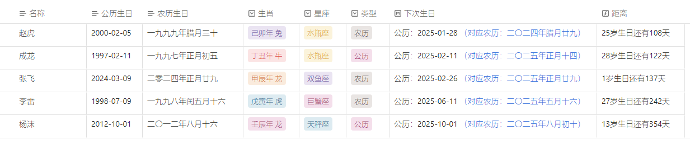

## 生日管理器
本库使用[components](https://cp.cc1234.cc/)插件探讨管理生日的可能方案。

可以管理农历生日与公历生日

## 介绍
### 文档属性
- birthdaySolar：公历生日，格式为 "YYYY-MM-DD"，如2004-12-21
- birthdayLunar：农历生日，格式为 "YYYY年MM月DD日"，全中文，如二〇〇四年腊月廿一
- birthdayType：生日类型，有两种选择："Lunar"、"Solar"(或"农历"、"公历")，默认为"Solar"("公历")
- nextBirthday：下个生日(公历日期)，脚本自动计算
- nextBirthdayString：下个生日(包含显示农历日期)，脚本自动计算，用于展示的另一种格式
- animal：生肖，由农历生日决定，脚本自动计算，会包含的干支纪年
- zodiac：星座，由公历生日决定，脚本自动计算

### 映射表
- 农历年份：['〇','一','二','三','四','五','六','七','八','九']
  - 对于〇，打不出也可以输入零
- 农历月份：['正','二','三','四','五','六','七','八','九','十','冬','腊']
  - 需要注意，一月为正月，十一月为冬月，十二月为腊月
- 农历日：['初一','初二','初三','初四','初五','初六','初七','初八','初九','初十','十一','十二','十三','十四','十五','十六','十七','十八','十九','二十','廿一','廿二','廿三','廿四','廿五','廿六','廿七','廿八','廿九','三十']
  - 二十是廿，拼音为nian

## 使用方法
选择生日类型，并输入对应类型的生日，脚本将自动计算下个生日、生肖、星座等信息。

## 鸣谢
- [中国农历公历换算算法](https://github.com/mumuy/calendar)
- [components](https://cp.cc1234.cc/)