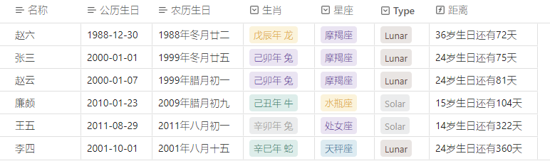
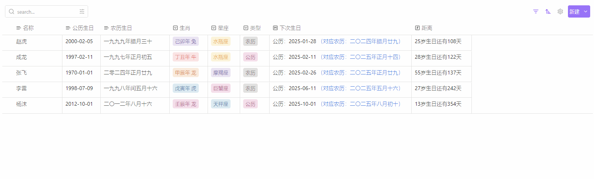

## 生日管理器
本库使用[components](https://cp.cc1234.cc/)插件探讨管理生日的可能方案。

可以管理农历生日与公历生日

### 部分说明
- 农历生日的输入格式为：xxxx年xx月xx日，如：2022年腊月廿九日

- 公历生日的输入格式为：xxxx年-xx月-xx日，如：2022-02-14

- 生肖使用农历生日年计算

- 星座使用公历生日月日计算

### 农历月日映射表
- 农历月映射表：['正','二','三','四','五','六','七','八','九','十','冬','腊']
- 农历日映射表：['初一','初二','初三','初四','初五','初六','初七','初八','初九','初十','十一','十二','十三','十四','十五','十六','十七','十八','十九','二十','廿一','廿二','廿三','廿四','廿五','廿六','廿七','廿八','廿九','三十']

## 使用方法

## 鸣谢
- [中国农历公历换算算法](https://github.com/mumuy/calendar)
- [components](https://cp.cc1234.cc/)